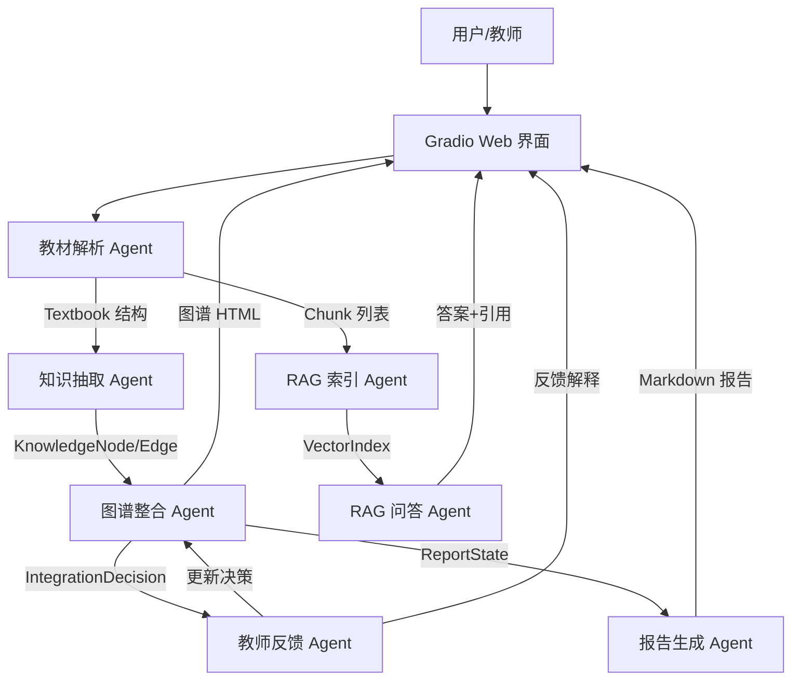

# Agent 架构说明

## 1. 架构总览

本系统采用**轻量多 Agent 编排**架构，将教材知识整合任务拆解为 6 个职责清晰的模块：教材解析 Agent、知识抽取 Agent、图谱整合 Agent、RAG 索引 Agent、RAG 问答 Agent、教师反馈 Agent、报告生成 Agent。

在工程实现上，各模块以 Python 函数调用衔接，而非引入 LangGraph、CrewAI 等框架。这种设计在 5 小时黑客松约束下兼顾了开发速度和架构清晰度。



## 2. 为什么不用复杂多 Agent 框架

LangGraph、CrewAI 等框架提供了 Agent 协作的状态机抽象，但本项目在 5 小时约束下选择轻量模块化编排，原因如下：

| 考量维度 | 轻量模块化（当前方案） | LangGraph/CrewAI 等框架 |
|---------|---------------------|------------------------|
| 部署风险 | 仅需 pip install，无框架依赖版本问题 | 框架版本迭代可能破坏兼容性 |
| 调试成本 | 直接函数调用、可打断点 | 状态在各 Agent 间流转，错误定位困难 |
| 上下文传递 | 显式参数传递，类型安全 | 框架自动序列化，可能丢失精度 |
| 学习曲线 | 纯 Python，无新概念 | 需要理解框架的状态机/工作流概念 |
| 扩展路径 | 可平滑迁移到 LangGraph | 框架既定，难以跳出其抽象范围 |

**核心原则**：架构服务于比赛时限，而非用框架证明技术含量。5 小时比赛的核心评分维度是"Agent 架构设计的合理性"（20分），而非"使用了哪个框架"。

## 3. 各 Agent/模块职责

### 3.1 教材解析 Agent（`src/parsers.py`）

**职责**：接收 PDF/MD/TXT 文件，统一输出 `Textbook` 结构（包含章节列表、总字数、总页数）。

**关键设计**：
- 快速模式：默认只解析前 60 页或前 8 章（`FAST_MODE_MAX_PAGES=60`, `FAST_MODE_MAX_CHAPTERS=8`），防止大 PDF 阻塞演示
- 中文章节识别正则：`第[一二三四五六七八九十百零\d]+[章节篇]` + `Chapter\s+\d+` + `^\d+[\.、]\s*.+`
- 单文件解析失败不影响其他文件

**接口**：
```python
def parse_file(filepath: str) -> Textbook
```

### 3.2 知识抽取 Agent（`src/knowledge_extractor.py`）

**职责**：按章节调用 DeepSeek，抽取知识点（node）和关系（edge），输出 JSON 结构化结果。

**关键设计**：
- 章节级调用，控制单次 token 消耗
- Prompt 中嵌入医学few-shot示例（如"炎症"），提高输出格式稳定性
- LLM 不可用时使用规则兜底：从章节标题和高频词生成节点，同章节节点间自动生成 parallel 关系

**接口**：
```python
def extract_from_textbook(tb: Textbook) -> tuple[list[KnowledgeNode], list[KnowledgeEdge]]
```

**输出格式**：
```python
# nodes: KnowledgeNode(name, definition, category, chapter, page, textbook)
# edges: KnowledgeEdge(source, target, relation_type, description)
# relation_type: contains | prerequisite | parallel | applies_to
```

### 3.3 RAG 索引 Agent（`src/chunking.py` + `src/rag.py`）

**职责**：将教材内容分块、向量化，建立检索索引。

**关键设计**：
- 分块策略：chunk_size=700（中文字符），overlap=100，min(700, len(text)) 末尾处理
- 向量化：sklearn TF-IDF，本地轻量、无需在线 Embedding API
- 检索：cosine_similarity，top_k=5

**接口**：
```python
class RAGEngine:
    def index(self, chunks: list[Chunk]) -> None
    def search(self, query: str) -> list[tuple[Chunk, float]]
    def ask(self, query: str) -> tuple[str, list[dict]]
```

### 3.4 图谱整合 Agent（`src/integrator.py`）

**职责**：跨教材识别重复知识点，生成 merge/keep/remove 决策，计算压缩比。

**关键设计**：
- 两阶段整合：
  - 阶段一（规则过滤）：名称相似度 ≥ 0.82（`MERGE_SIM_THRESHOLD=0.82`）→ merge 候选
  - 阶段二（决策生成）：跨教材候选 → merge；同教材候选 → keep
- 压缩估算：正文级压缩，`original_chars` = 教材正文总字数，`integrated_chars` = 去重后知识点定义字数。知识点定义是对正文的高度提炼，因此压缩比自然远低于 30%（作为后续完整正文压缩算法的目标值）

**接口**：
```python
def integrate(nodes: list[KnowledgeNode], total_body_chars: int = 0) -> tuple[list[IntegrationDecision], dict]
# stats: {total_nodes, total_decisions, merge_count, keep_count, remove_count, original_chars, integrated_chars, compression_ratio}
# original_chars = 教材正文总字数, integrated_chars = 去重后知识点定义字数
```

### 3.5 RAG 问答 Agent（RAGEngine.ask + build_prompt）

**职责**：基于检索上下文生成带引用的答案。

**Prompt 设计（防幻觉）**：
```
你是一个医学教材知识助手。请只基于以下教材原文回答问题。
如果上下文中找不到答案，请明确说"当前知识库中未找到相关信息"。
不要使用上下文之外的知识。回答请用中文。

教材内容：
{ctx_text}

问题：{query}

请回答并在末尾附上来源引用（教材、章节、页码）。
```

**容错**：DeepSeek 失败时返回 top-1 chunk 原文和来源。

### 3.6 教师反馈 Agent（`src/feedback.py`）

**职责**：解析教师指令，修改对应整合决策。

**支持的四类指令**：
| 指令模式 | 系统行为 |
|---------|---------|
| 保留 \<知识点\> | remove → keep，标记 overridden |
| 删除 \<知识点\> | keep → remove，标记 overridden |
| 不要合并 \<A> 和 \<B> | merge → keep，标记 overridden |
| 为什么合并 \<知识点\> | 返回决策理由 |

**设计理由**：规则匹配而非 LLM 解析——响应时间 <100ms，行为完全可预测，无幻觉风险。

### 3.7 报告生成 Agent（`src/report_generator.py`）

**职责**：汇总系统状态生成 Markdown 报告，写入 `report/整合报告.md`。

**接口**：
```python
def generate_report(
    textbooks: dict[str, Textbook],
    nodes: list[KnowledgeNode],
    edges: list[KnowledgeEdge],
    decisions: list[IntegrationDecision],
    stats: dict,
) -> str
```

## 4. 数据流与调用链路

完整流程：

```
1. 用户上传 PDF/MD/TXT 文件
   → on_parse() 调用 parse_file()
   → Textbook 结构存入全局 state

2. 解析完成后自动建立 RAG 索引
   → chunk_all() 将教材按章节分块
   → rag_engine.index() 构建 TF-IDF 轻量向量矩阵

3. 用户点击"抽取知识点/构建图谱"
   → extract_from_textbook() 遍历每章节调用 DeepSeek
   → build_graph_html() 生成 pyvis 可交互 HTML 图谱

4. 用户点击"执行跨教材整合"
   → integrate() 基于名称相似度生成 merge/keep/remove 决策
   → 返回决策表和压缩统计

5. 用户在 RAG 问答输入问题
   → rag_engine.search() 检索 top-5 chunk
   → rag_engine.ask() 调用 DeepSeek 生成答案
   → 返回答案 + 引用来源列表

6. 用户输入教师反馈指令
   → process_feedback() 解析指令，更新对应决策

7. 用户点击"生成整合报告"
   → generate_report() 汇总所有状态写入 Markdown 文件
```

## 5. RAG Pipeline 详细设计

```
用户问题
    │
    ▼
TF-IDF transform（问题向量化）
    │
    ▼
cosine_similarity → top-5 chunks
    │
    ▼
DeepSeek Prompt（含检索上下文）
    │
    ▼
答案 + 引用来源（教材、章节、页码、相关度）
```

**分块参数**（来自 `src/config.py`）：
| 参数 | 值 | 理由 |
|------|-----|------|
| CHUNK_SIZE | 700 | 容纳一个完整概念解释或段落 |
| CHUNK_OVERLAP | 100 | 减少概念被切断造成的检索缺失 |
| TOP_K | 5 | 上下文长度和答案覆盖的平衡点 |
| MERGE_SIM_THRESHOLD | 0.82 | 平衡召回率和精确率 |

**为什么当前版本用 TF-IDF**：
- 不依赖在线 Embedding API，避免比赛现场额度、网络和鉴权风险
- 不下载本地大模型，避免魔搭部署和本机首次下载卡住
- sklearn 依赖稳定，能在 5 小时内保证 RAG 带引用闭环
- 后续版本可升级到 API embedding 或本地 sentence-transformers

## 6. Prompt 工程

### 6.1 知识点抽取 Prompt（`src/knowledge_extractor.py`）

```python
EXTRACT_PROMPT = """你是一个医学教材知识工程师。请从以下教材章节中抽取核心知识点和它们之间的关系。

章节: {chapter}
教材: {textbook}
内容:
{text}

请输出 JSON，格式如下：
{{
  "nodes": [
    {{
      "name": "知识点名称",
      "definition": "一句话定义",
      "category": "核心概念|机制|方法|现象|结构",
      "chapter": "{chapter}",
      "page": {page}
    }}
  ],
  "edges": [
    {{
      "source": "知识点A",
      "target": "知识点B",
      "relation_type": "contains|prerequisite|parallel|applies_to",
      "description": "简短关系描述"
    }}
  ]
}}

要求：
- 每章最多抽取8个核心知识点
- 只抽取医学相关知识点
- 关系类型只用 contains/prerequisite/parallel/applies_to
- 如果内容太少可返回空列表"""
```

### 6.2 RAG 回答 Prompt（`src/rag.py` RAGEngine.build_prompt）

```python
"""你是一个医学教材知识助手。请只基于以下教材原文回答问题。
如果上下文中找不到答案，请明确说"当前知识库中未找到相关信息"。
不要使用上下文之外的知识。回答请用中文。

教材内容：
{ctx_text}

问题：{query}

请回答并在末尾附上来源引用（教材、章节、页码）。"""
```

### 6.3 整合决策 Prompt

当前版本使用规则（名称相似度），边界样本不送 LLM 判断。这是 5 小时版本的取舍。

## 7. 已知局限

| 局限 | 影响 | 后续改进方案 | 优先级 |
|------|------|------------|--------|
| TF-IDF 对语义改写不敏感 | 同义但不同词的检索可能较弱 | 后续升级 API embedding 或本地 sentence-transformers | P1 |
| 知识点级压缩而非正文压缩 | 用户感知压缩比与正文压缩不同 | 基于整合结果生成完整精华教材正文 | P1 |
| PDF 快速模式只处理前 60 页 | 长教材后半部分被忽略 | 增加"全量处理"开关 | P0 |
| 扫描版 PDF 不支持 | 旧版教材无法解析 | 集成 PaddleOCR | P2 |
| 教师反馈仅支持 4 类固定指令 | 复杂反馈无法解析 | 引入 LLM 理解反馈意图 | P1 |
| 图谱为单视图（pyvis 力导向图） | 多视图是 P1 加分项 | 保留数据结构，UI 可扩展 | P2 |

### 7.1 按 ROI 排序的改进路线

| 优先级 | 改进项 | 预计工时 | 收益 |
|--------|--------|----------|------|
| P0 | PDF 全量处理开关 | 15 分钟 | 消除快速模式限制，评委可自选 |
| P1 | 升级 embedding（API 或本地） | 1-2 小时 | RAG 检索质量显著提升 |
| P1 | 优化知识抽取 prompt（few-shot） | 20 分钟 | 知识点质量提高，减少碎片节点 |
| P1 | 教师反馈接入 LLM 理解 | 30 分钟 | 支持自然语言指令，不再限于 4 类规则 |
| P2 | 桑基图 / 多视图图谱 | 30 分钟 | 可视化加分项 |
| P2 | 扫描版 PDF OCR | 2+ 小时 | 扩展教材兼容范围 |

### 7.2 PDF 章节提取现状与改进方向

**当前状态**：PDF 章节提取依赖目录页（TOC）检测 + 字体大小启发式 + 正则匹配（"第X章"等），对版面复杂的医学教材（多栏排版、编委名单页、页眉页脚干扰）召回率较低。部分教材仅能提取少量章节标题。

**影响范围**：知识图谱构建依赖章节结构，章节提取失败会导致该教材的知识图谱节点稀疏，但不影响 RAG 问答（RAG 使用全文分块检索，不依赖章节边界）。

**改进方向（P0）**：
1. 引入 PyMuPDF 字体层级自动识别标题（上下文字体大小对比）
2. 用 LLM 对疑似目录页进行二次校验（输入页面文本 → 输出章节列表 JSON）
3. 支持用户手动标注章节边界，作为兜底方案

**备注**：5 小时时限内优先保证了跨教材整合和 RAG 问答的完整闭环，PDF 章节提取作为前置环节的深度优化留待后续迭代。

## 8. 创新点

### 8.1 医学教材优先验证，架构通用可迁移

系统以赛方提供的医学教材为验证对象，但：
- 数据结构（Textbook/Chapter/Chunk/KnowledgeNode）不依赖医学本体
- 整合算法使用通用相似度，不依赖医学术语库
- RAG pipeline 是通用检索生成流程

**可迁移学科**：计算机、经济学、法律、文学等任何有明确章节结构的多本教材场景。

### 8.2 5 小时版本的快速模式设计

架构层面支持两种模式：
- **快速模式**（默认）：PDF 只解析前 60 页/前 8 章，保证演示稳定
- **完整模式**：处理全部内容，由 `FAST_MODE_MAX_PAGES` / `FAST_MODE_MAX_CHAPTERS` 配置项控制

用户感知是"等待时间长短"，而非"系统崩溃"。

### 8.3 规则反馈优先于 LLM 反馈

教师反馈使用规则匹配而非 LLM 解析：
- 响应时间 <100ms（无需 API 调用）
- 行为完全可预测，无幻觉风险
- 调试成本极低，错误边界清晰

### 8.4 双重知识压缩可视化

系统同时展示：
- **数字压缩比**：原始字数 vs 整合后估算字数
- **图谱压缩**：整合前节点数 vs 整合后节点数

让评委既能看比例数字，又能看图谱直观变化。

## 9. 核心接口一览

| 模块 | 函数名 | 输入 | 输出 |
|------|--------|------|------|
| 解析 | `parse_file` | `str` 文件路径 | `Textbook` |
| 分块 | `chunk_all` | `dict[str, Textbook]` | `list[Chunk]` |
| 索引 | `RAGEngine.index` | `list[Chunk]` | `None`（更新内部状态） |
| 检索 | `RAGEngine.search` | `str` 查询 | `list[tuple[Chunk, float]]` |
| 抽取 | `extract_from_textbook` | `Textbook` | `tuple[list[KnowledgeNode], list[KnowledgeEdge]]` |
| 整合 | `integrate` | `list[KnowledgeNode]` | `tuple[list[IntegrationDecision], dict]` |
| 问答 | `RAGEngine.ask` | `str` 问题 | `tuple[str, list[dict]]`（答案+引用） |
| 反馈 | `process_feedback` | `str, list[Decision]` | `tuple[str, list[Decision]]`（解释+更新决策） |
| 报告 | `generate_report` | 系统状态 | `str`（Markdown） |

## 10. 评分维度自检

| 评分维度 | 基础分 | 进阶分 | 我们的设计 |
|---------|-------|-------|-----------|
| 架构总览 | 3 | +1 | 7个模块清晰分工，Mermaid 图展示 |
| 设计决策论证 | 5 | +2 | 详细对比轻量编排 vs 框架化方案，说明为什么不用复杂框架 |
| RAG Pipeline | 4 | +1 | 分块+TF-IDF轻量向量化+检索+生成完整链路 |
| Prompt 工程 | 2 | +1 | 知识点抽取/RAG 两套 Prompt，有格式约束 |
| 已知局限 | 1 | +1 | 6项局限 + 具体改进方案 |
| 创新点 | 0 | 5 | 医学优先通用架构、快速模式、规则反馈、双重压缩可视化 |
