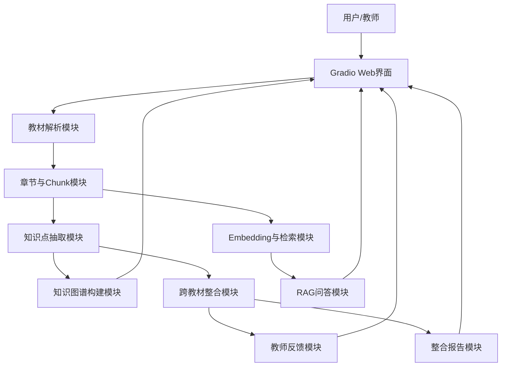

# 系统设计

## 1. 架构总览

系统采用 Gradio 单页应用 + Python 模块化后端。



各模块均为 Python 函数调用，无复杂框架依赖，部署到魔搭创空间无额外依赖风险。

## 2. 技术选型

| 层级 | 技术 | 理由 |
| --- | --- | --- |
| Web 界面 | Gradio | 开发快，部署简单，适合 5 小时比赛 |
| LLM | DeepSeek API | 中文能力强，用户已确定 |
| PDF 解析 | PyMuPDF | 逐页解析，能获取页码 |
| 文本向量化 | MiniMax embo-01 API | 避免本机模型下载和算力瓶颈 |
| 检索 | API 向量 + cosine similarity | 轻量，足够支撑演示路径 |
| 检索兜底 | sklearn TF-IDF | MiniMax API 不可用时保证系统不中断 |
| 图谱展示 | pyvis | 快速生成可交互 HTML 图谱 |
| 数据格式 | dataclass / Enum | 统一结构，便于表格展示和报告生成 |

**当前版本使用 MiniMax embedding + TF-IDF 兜底**：优先满足赛题的向量化 RAG 要求，同时保留本地兜底以降低部署风险。

## 3. 数据流

### 3.1 上传到解析

1. 用户上传 PDF / MD / TXT
2. 系统识别文件类型，调用对应解析器
3. PDF 使用 PyMuPDF 逐页读取，保留页码
4. Markdown 使用 `#` / `##` 识别章节
5. TXT 使用中文章节正则识别
6. 输出统一 `Textbook` 结构

### 3.2 解析到索引

1. 章节文本输入 chunking 模块
2. 按 700 字切块，overlap 100 字
3. 每个 chunk 带教材、章节、页码元数据
4. MiniMax embo-01 生成 chunk 向量，`type=db`
5. 检索模块保存向量矩阵和 chunk 列表；失败时回退 TF-IDF

### 3.3 解析到图谱

1. 知识抽取模块按章节调用 DeepSeek
2. DeepSeek 输出知识点和关系 JSON
3. 系统清洗和校验 JSON
4. 图谱模块生成节点、边和 HTML（pyvis）
5. 快速模式默认只处理前 60 页或前 8 章

### 3.4 图谱到整合

1. 跨教材整合模块对知识点名称做相似度计算
2. 名称相似度 ≥ 0.82 形成 merge 候选
3. 跨教材候选 → merge，同教材候选 → keep
4. 计算压缩比
5. 前端展示整合结果决策表

### 3.5 RAG 问答

1. 用户输入问题
2. MiniMax embo-01 生成 query 向量，`type=query`
3. 使用余弦相似度找出 top-5 chunk；失败时回退 TF-IDF
4. RAG 模块将 chunk 注入 DeepSeek Prompt
5. 模型生成答案
6. 系统返回答案、引用（教材、章节、页码）、原文片段

### 3.6 教师反馈

1. 教师输入自然语言指令（保留/删除/不要合并/为什么合并）
2. 反馈模块用规则匹配解析意图
3. 修改对应整合决策，标记为 overridden
4. 返回处理解释，更新决策表

## 4. 模块接口

### parse_file

```python
def parse_file(filepath: str) -> Textbook
```

输入：文件路径
输出：`Textbook(filename, status, chapters, total_chars, total_pages, error)`

### chunk_all

```python
def chunk_all(textbooks: dict[str, Textbook]) -> list[Chunk]
```

输入：教材字典
输出：Chunk 列表，每个 Chunk 包含 chunk_id, textbook, chapter, page, text

### RAGEngine.index

```python
def index(self, chunks: list[Chunk]) -> None
```

优先建立 MiniMax embedding 向量索引，失败时建立 TF-IDF 兜底索引。

### RAGEngine.ask

```python
def ask(self, query: str) -> tuple[str, list[dict]]
```

输入：用户问题
输出：(答案文本, [{教材, 章节, 页码, 相关度, 原文片段}])

### extract_from_textbook

```python
def extract_from_textbook(tb: Textbook) -> tuple[list[KnowledgeNode], list[KnowledgeEdge]]
```

输入：Textbook
输出：(节点列表, 边列表)

### integrate

```python
def integrate(nodes: list[KnowledgeNode]) -> tuple[list[IntegrationDecision], dict]
```

输入：知识点节点列表
输出：(决策列表, 统计字典 {merge_count, keep_count, remove_count, original_chars, integrated_chars, compression_ratio})

### process_feedback

```python
def process_feedback(message: str, decisions: list[IntegrationDecision]) -> tuple[str, list[IntegrationDecision]]
```

输入：(教师指令, 当前决策列表)
输出：(处理解释, 更新后决策列表)

### generate_report

```python
def generate_report(textbooks, nodes, edges, decisions, stats) -> str
```

输入：系统当前状态
输出：Markdown 格式报告

## 5. 状态管理

Gradio 中使用模块级全局变量保存状态：

- `textbooks: dict` — 教材字典
- `rag_engine: RAGEngine` — RAG 引擎实例
- `all_nodes: list` — 知识点节点列表
- `all_edges: list` — 知识点边列表
- `decisions: list` — 整合决策列表
- `integration_stats: dict` — 整合统计
- `feedback_history: list` — 反馈历史

各 Tab 通过回调函数读写这些全局状态。

## 6. 错误处理

| 场景 | 处理 |
| --- | --- |
| 文件解析失败 | 文件状态标记 failed，其他文件继续 |
| LLM 超时 | 返回提示并使用 top chunk 原文兜底 |
| JSON 解析失败 | 尝试修复，失败后使用规则兜底 |
| Embedding API 不可用 | 自动回退 TF-IDF |
| 图谱 HTML 失败 | 展示节点和边表格兜底 |
| 无 API Key | 页面提示，RAG 和抽取使用规则兜底模式 |

## 7. 部署设计

本机开发完成后部署到魔搭创空间。仓库中包含 `app.py` 和 `requirements.txt`，空间配置 `DEEPSEEK_API_KEY` 后启动 Gradio。

备用方案为 Gradio share 临时链接（修改 `demo.launch(share=True)`）。

## 8. 快速模式配置

通过环境变量控制：

```bash
FAST_MODE_MAX_PAGES=60       # PDF 默认只解析前 60 页
FAST_MODE_MAX_CHAPTERS=8     # 每本教材默认最多处理 8 个章节
```

设置为 -1 可关闭快速模式，处理全量内容（耗时较长）。

## 9. 后续增强（当前版本不包含）

- 混合检索：向量 + BM25
- sentence-transformers 向量化
- RAG benchmark 自建
- DOCX / Excel 支持
- Docker 一键部署
- 多视图图谱
- 扫描版 PDF OCR
- 基于整合结果生成完整精华教材正文
